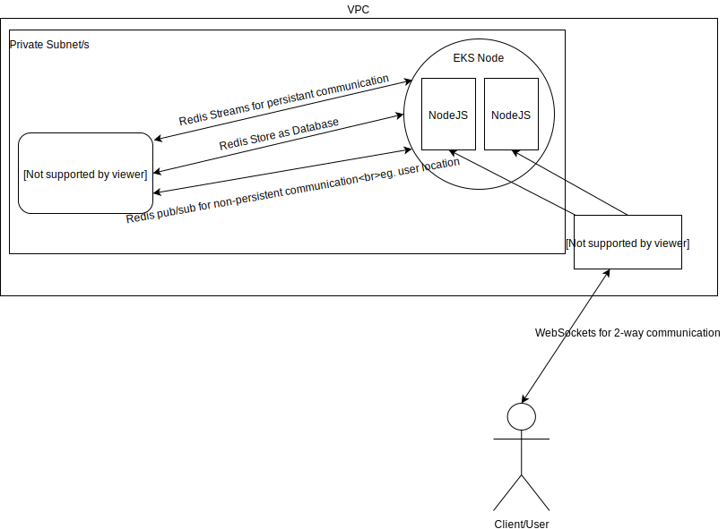

### Architecture Details

1. Using an AWS managed EKS cluster for deploying the kubernetes configuration. (kube folder)
2. It's a single node cluster using t3.a.small instance type with 2cpus and 2gb memory.
3. Running two pod replicas for redundancy.
4. Running an ELB service in front of the pods with a public subnet.
5. Backend application is completely stateless.
6. Using AWS managed Redis cluster for all database and stream needs.
7. Everything above is in a single VPC where everything is in a private subnet except ELB.
8. Using github action for CI/CD needs

### Browser

Any browser with websocket is supported. If websockets are not working in your browser for any
reason, the app will not work.

### Need to know
To make it easier for testing, everytime you refresh your browser, you will be randomly
assigned a new user. So if you switch between tabs or even refresh your current tab, you will
be a new user

### How to develop locally

1. Make sure you have following things already in the system
   - node version `lts/fermium`
   - redis `6.x`
2. Run `yarn install` in backend and frontend folders
3. Start redis with default parameters `redis-server`
4. Run `yarn start:dev` in backend folder.
5. Create an `.env` file in frontend folder with value
   `REACT_APP_BACKEND_ENDPOINT=localhost:5000`
   change value to whatever host and port backend is started on.
6. Run `yarn start` in frontend folder.
7. You should see your application at `localhost:3000`

Note: If you do not start redis with default parameters, you can create
a `.env` file in backend folder with keys `REDIS_HOST` and `REDIS_PORT`

### How to test the system with a local kubernetes setup

You definitely don't need the below if you just want to develop. It's only
for those rare cases when you wanna see the whole architecture as it is.

1. Make sure you have the following things already in the system along
   with everything in `How to develop locally`
   _ minikube
   _ kubectl
   _ docker
   _ Your local machine IP Address

- If you do not know your local IP Address, you can check it by starting frontend
  and you'll see it in the terminal along with `localhost`

2. Start minikube `minikube start`
3. Start redis with command `redis-server --protected-mode no`
4. Building your local docker image
   - Make sure you are in root directory of the repo
   - Run `eval $(minikube docker-env)`
   - Run `docker build -t clover .`
5. Start kubernetes cluster along with pods and services
   - Run `kubectl apply -f kube/clover.development.yaml`
6. You can check the status of your pods and service by
   - `kubectl get pods`
   - `kubectl get svc clover`
7. Now, to access our cluster, we have to tunnel our network
   - `minikube service clover --url`
8. Access the link and hurray.
9. To stop and clean up
   - `kubectl delete -f kube/clover.development.yaml`
   - `minikube stop`

### Considerations I would take for full production load

Because currently it's running on a pretty small instance which already
contains 6 pods (4 system pods) + (2 application pods) it's not exactly a big node to
have great performance. I have balanced the parameters to receive and push updates such that
all updates are propogated within ~1sec. We can increase our performance by atleast allocating 1 cpu/pod
and having a bigger redis cluster.
